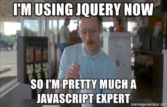

# JQuery Advanced

## Learning Objectives

- Learn how to load **_jQuery_** from a _CDN_ in a page
- Learn the different ways to create _DOM_ elements with **_jQuery_**
- Learn how to modify elements
- Learn how to add new elements to a page with different positions
- Learn how to add a click handler on an element
- Learn how to send `GET`, `POST`, `DELETE` or any type of `AJAX` query with - **_jQuery_**
- Learn how to create a _pagination_

## Requirements

- Allowed editors: `vi`, `vim`, `emacs`, `Visual Studio Code`
- All your files should end with a new line
- A `README.md` file, at the root of the folder of the project, is mandatory