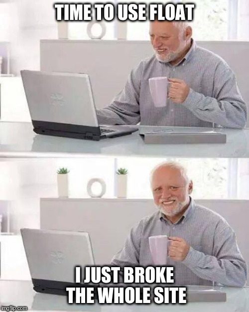

# FLEXBOX

## Learning Objectives

### General

- What is **_Flexbox_**?
- How to convert float positioning to a flex display
- How to horizontally and vertically align elements using **_Flexbox_**
- The difference between the _main_ and _cross_ axes
- Properties that work on flex elements vs flex container
- Shorthands for flex
- How to create a new page with flex in mind

## Requirements

- Allowed editors: `vi`, `vim`, `emacs`
- A `README.md` at the root of the project directory is mandatory
- All of your code will be executed on `Ubuntu 18.04` using `Python 3.7.x`
- All of your files should end with a new line
